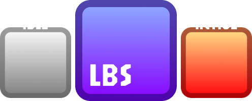

<div align="center">
  <kbd>🦀 Rust</kbd>
  <kbd>🪶 GTK4</kbd>
  <kbd>🚀 Wayland & X11</kbd>
  <kbd>📂 Open-source</kbd>
  <br><br>
  
  <h1>Linux Battle Shaper (LBS)</h1>
  <p><b>A powerful, universal per-process CPU limiter for Linux with Wayland and X11 support.</b></p>

  <a href="#installation"><b><kbd> <br> Installation <br> </kbd></b></a>
  <a href="#usage"><b><kbd> <br> Usage <br> </kbd></b></a>
  <a href="#build"><b><kbd> <br> Build <br> </kbd></b></a>

   <h2></h2>
</div>

---

**Linux Battle Shaper (LBS)** is a modern Linux utility (similar to BES for Windows) that allows you to limit the CPU usage of specific processes.

## ✨ Features

- **🎯 Precise Limiting**: Set CPU usage limits from 0% to 99.9%.
- **🔄 Fine-tuned Cycles**: Adjust the "Awake Cycle" frequency from 2ms to 400ms to balance smoothness and resource saving.
- **🖥️ Universal Focus Monitor**: Automatically unlimit a process when you switch to its window. Supports:
  - **Hyprland** (native)
  - **Sway** (native)
  - **KDE Plasma** (Wayland via D-Bus and X11)
  - **GNOME, XFCE, and others** (X11/XWayland via xprop)
- **📥 Tray**: Minimize to a system tray icon showing the current status (Active/Idle).
- **🛡️ Safe**: Automatically sends `SIGCONT` to all limited processes on exit to prevent them from hanging in a STOP state.
- **⚡ Fast**: Written in Rust for maximum performance and minimal memory footprint.

## <a name="installation"></a>📥 Installation

### AppImage (binary)
- **AppImage**: Download the latest version from the [Releases][Download] page. (run `chmod +x LBS-v0.1.0.AppImage` and then `./LBS-v0.1.0.AppImage` and see [Usage](#usage))

<!-- todo
### AUR (auto-build)
- **[AUR](https://aur.archlinux.org/packages/lbs)**: 
```bash
yay -S lbs
``` 
or 
```bash
paru -S lbs 
``` -->

## <a name="usage"></a>🚀 Usage
1. Launch LBS.
2. Click the **"Target..."** button to select a process from the list.
3. Adjust the limit slider (e.g., -50% will limit the process to half its speed).
4. Enable **"Unlimit at Focus"** in the settings if you want the app to run at full speed whenever its window is active. (optional)

## <a name="build"></a>📦 Build

### Prerequisites
You will need **Rust**, **GTK4**, **xprop** and **dbus-send** installed on your system.

### Building from Source
1. Install [Rust](https://www.rust-lang.org/tools/install).

2. Install build-time dependencies:
   - **Ubuntu/Debian**: `sudo apt install build-essential libgtk-4-dev pkg-config`
   - **Arch Linux**: `sudo pacman -S --needed base-devel gtk4 pkg-config`
   - **Fedora**: `sudo dnf install gtk4-devel pkgconf-pkg-config`

3. Clone the repository:
   ```bash
   git clone https://github.com/Agzes/LBS.git
   cd LBS
   ```

4. Build the project:
   ```bash
   cargo build --release
   ```

5. Run the binary:
   ```bash
   ./target/release/lbs
   ```


## 📄 License
Distributed under the MIT License. See [LICENSE](LICENSE) for more information.

---

<kbd>With</kbd> <kbd>❤️</kbd> <kbd>by</kbd> <kbd>Agzes</kbd><br>
<kbd>pls ⭐ project!</kbd>

[Download]: https://github.com/Agzes/LBS/releases
